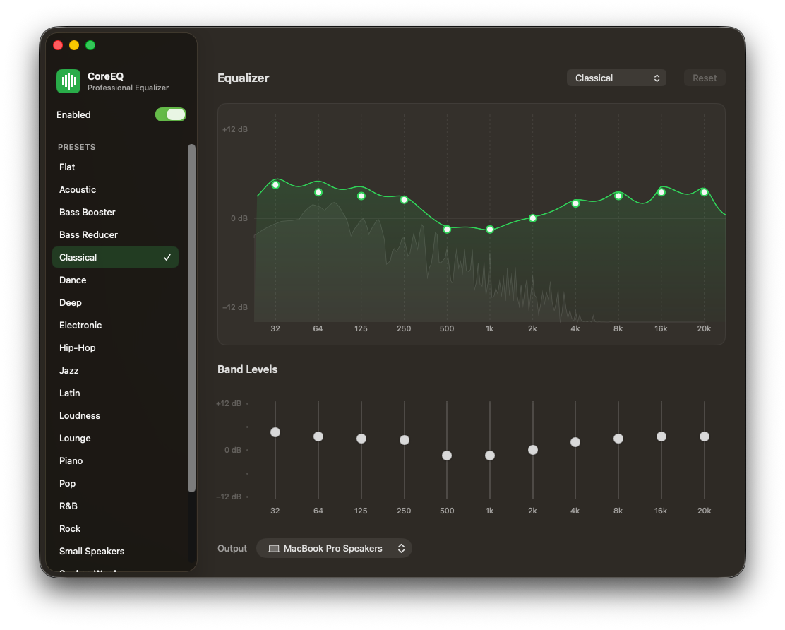

#+TITLE: CoreEQ
#+SUBTITLE: Professional system-wide equalizer for macOS

CoreEQ is a system-wide equalizer for macOS. It applies an eleven-band graphic
EQ to *everything you hear* — music, video, calls, games — no matter which
application is playing, and without a virtual audio driver or a kernel
extension. Processing runs entirely on Apple's native Core Audio process-tap
API, so there is nothing to install into the system and nothing left behind
when CoreEQ is not running.

* Features

** System-wide processing, driver-free

A global Core Audio process tap captures the mixed output of every application,
equalizes it, and plays it back through the current output device. No
=/Library/Audio= component, no reboot, no per-application setup. Quit CoreEQ and
system audio returns to its normal path immediately.

** Eleven-band equalizer

The professional ISO octave ladder — 32, 64, 125, 250, 500 Hz and 1, 2, 4, 8,
16, 20 kHz — at fixed centre frequencies, each adjustable ±12 dB. Bands are RBJ
peaking biquads processed in transposed direct form II, with gain changes
smoothed over ~50 ms so preset switches and slider moves never click or step.

** Live frequency response, directly editable

The main window plots the true combined magnitude response of the filter chain,
computed from the same coefficients the audio path renders with — not an
interpolated approximation. Drag a band's handle to change its gain, hover it to
see the filter's own bell drawn beneath the composite, or double-click to reset
that band alone.

** Real-time spectrum analyzer

A Hann-windowed FFT of the audio actually reaching your speakers is drawn behind
the response curve on the same frequency axis, with fast-attack / slow-release
smoothing, so you can read the programme material against your EQ shaping.

** Presets

Twenty-two built-in profiles — the classic set familiar from Apple Music and
Spotify — plus your own, saved from the current band values and managed from the
sidebar. Built-ins are immutable; your presets can be renamed, duplicated,
edited, and deleted. Switching is instantaneous and glitch-free.

** Menu bar control

CoreEQ runs as a menu bar application with no Dock icon. The status menu carries
a master switch, the preset list, a live response preview, three Quick EQ tone
controls (bass, mid, treble) layered over the active preset, and output device
selection — all without opening a window.

** Built to stay running

The engine rebuilds itself when the default output device changes, when the
sample rate changes, and after the machine wakes from sleep, with bounded
automatic retry on failure. Bypass is a real-time flag rather than a teardown,
so comparing processed and original sound is instantaneous. The render path
never allocates or blocks: parameter updates are staged behind an unfair lock
and picked up only when uncontended.

* Requirements

- macOS *14.2* or later
- Permission to record system audio, requested on first launch

* Installation

** Homebrew (recommended)

The simplest way to install CoreEQ:

#+begin_src sh
brew tap andreypudov/core-eq
brew trust andreypudov/core-eq
brew install --cask core-eq
#+end_src

CoreEQ is currently unsigned/unnotarized, so macOS may block first launch. If
that happens, allow it in System Settings → Privacy & Security, or run:

#+begin_src sh
xattr -dr com.apple.quarantine /Applications/CoreEQ.app
#+end_src

Upgrade later with:

#+begin_src sh
brew update
brew upgrade --cask core-eq
#+end_src

** Build from source

Requires Xcode 16 or later. Locally built applications are not quarantined by
macOS, so CoreEQ launches with no Gatekeeper warnings:

#+begin_src sh
git clone https://github.com/AndreyPudov/core-eq.git
cd core-eq
make install
#+end_src

This builds a Release copy and installs it to =/Applications=.

** Prebuilt binary (manual)

Download the latest =CoreEQ-x.y.zip= from the *Releases* page, unzip, and move
=CoreEQ.app= to =/Applications=. The binary is not notarized, so macOS will
report on first launch that it could not verify the app. Either open System
Settings → Privacy & Security and choose *Open Anyway*, or clear the quarantine
flag:

#+begin_src sh
xattr -dr com.apple.quarantine /Applications/CoreEQ.app
#+end_src

* First launch

1. Launch CoreEQ. A sliders icon appears in the menu bar; there is no Dock icon.
2. Grant *System Audio Recording* when macOS asks. CoreEQ needs it to process
   the sound you hear. Nothing is recorded, stored, or transmitted. The
   permission can also be granted under System Settings → Privacy & Security →
   Screen & System Audio Recording.
3. Choose a preset. The sound changes immediately.

* Using CoreEQ

*Menu bar* — the master switch, preset selection, Quick EQ tone controls, and
output device, plus *Open Equalizer…* and *Quit*.

*Main window* — presets in the sidebar with the master switch above them; the
response graph, band sliders, and output device on the right. The preset menu
and *Reset* sit beside the Equalizer heading. Right-click any preset for *New
Preset*, *Rename*, *Duplicate*, *Save Changes*, *Reset to Preset*, and *Delete*.

Editing the active preset marks it *Edited*; *Save Changes* writes the values
into one of your own presets, *Reset* discards them. Your edits, the active
preset, and the on/off state are restored on every launch.

* Limitations

- Stereo processing: on multi-channel devices, channels beyond the first two
  pass through unequalized.
- Presets cannot yet be imported or exported as files.

* Development

Architecture notes, build and test instructions are in
[[file:DEVELOPMENT.org][DEVELOPMENT.org]].

#+begin_src sh
make build   # build the Release configuration
make test    # run the unit test suite
make release # build and package a distributable zip
#+end_src

* License

Apache License 2.0. See [[file:LICENSE][LICENSE]].
