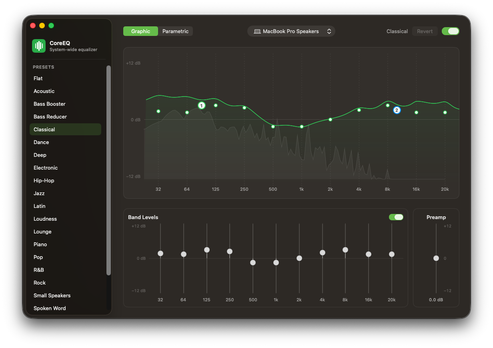

#+TITLE: CoreEQ
#+SUBTITLE: System-wide equalizer for macOS

CoreEQ equalizes *everything you hear* — music, video, calls, games — whatever
application is playing, with no virtual audio driver and no kernel extension.
It runs on Apple's native Core Audio process-tap API, so there is nothing
installed into the system and nothing left behind when CoreEQ is not running.

* Features

** System-wide processing, driver free

A global process tap captures the mixed output of every application, equalizes
it, and plays it back through the current output device. No =/Library/Audio=
component, no reboot, no per-application setup. Quit CoreEQ and system audio
returns to its normal path immediately.

** One filter chain, two ways to edit it

The *Graphic* editor is the professional ISO octave ladder — 32, 64, 125, 250,
500 Hz and 1, 2, 4, 8, 16, 20 kHz — at fixed centre frequencies, each adjustable
±12 dB. The *Parametric* editor adds up to sixteen bands of your own anywhere
between 20 Hz and 20 kHz, each a bell, shelf, or pass filter with its own
frequency, gain, and Q.

The two editors are tabs on the editing area's own border, and both edit the
same chain and the same graph: the sliders are eleven filters that happen to be
locked to the ladder, and an added band is one that is not. Nothing is converted, approximated, or reconciled between the two
views, so a change made in either is exact and reversible.

** Live frequency response, directly editable

The window plots the true combined magnitude response of the chain, computed
from the same coefficients the audio path renders with — not an interpolated
approximation. Drag a handle to change a band, double-click one to reset it,
or double-click empty space to add a parametric band exactly where you clicked.

** Real-time spectrum analyzer

A Hann-windowed FFT of the audio actually reaching your speakers is drawn
behind the response curve on the same frequency axis, with fast-attack /
slow-release smoothing, so you can read the programme material against your
shaping.

** Presets

Twenty-two built-in profiles — the classic set familiar from Apple Music and
Spotify — plus your own, managed from the sidebar. Built-ins are immutable;
your presets can be renamed, duplicated, edited, and deleted. Switching is
instantaneous and glitch-free.

** Per-device settings

The preset in use, any unsaved edits to it, and the preamp follow the *output
device*, the way volume does on macOS. Your headphone curve comes back when you
plug in headphones and gives way to the speaker curve when you unplug them. The
preset library itself is shared across devices.

** Menu bar control

CoreEQ runs as a menu bar application with no Dock icon. The status menu carries
the master switch, output device, the preset list, a live response preview, and
three Quick EQ tone controls (bass, mid, treble) layered over the active preset
— all without opening a window.

** Built to stay running

The engine rebuilds itself when the default output device changes, when the
sample rate changes, and after the machine wakes from sleep, with bounded
automatic retry on failure. Bypass is a real-time flag rather than a teardown,
so comparing processed and original sound is instantaneous. The render path
never allocates or blocks: parameter updates are staged behind an unfair lock
and picked up only when uncontended, and gain changes are smoothed over ~50 ms
so preset switches and slider moves never click or step.

* Requirements

- macOS *14.2* or later
- Permission to record system audio, requested on first launch

* Installation

** Homebrew (recommended)

#+begin_src sh
brew tap andreypudov/core-eq
brew trust andreypudov/core-eq
brew install --cask core-eq
#+end_src

Upgrade later with =brew update && brew upgrade --cask core-eq=.

CoreEQ is currently unsigned and unnotarized, so macOS may block first launch.
Allow it in System Settings → Privacy & Security, or clear the quarantine flag:

#+begin_src sh
xattr -dr com.apple.quarantine /Applications/CoreEQ.app
#+end_src

** Build from source

Requires Xcode 16 or later. Locally built applications are not quarantined, so
CoreEQ launches with no Gatekeeper warnings:

#+begin_src sh
git clone https://github.com/AndreyPudov/core-eq.git
cd core-eq
make install
#+end_src

This builds a Release copy and installs it to =/Applications=.

** Prebuilt binary

Download the latest =CoreEQ-x.y.zip= from the *Releases* page, unzip, and move
=CoreEQ.app= to =/Applications=, then clear the quarantine flag as above.

* First launch

1. Launch CoreEQ. A sliders icon appears in the menu bar; there is no Dock icon.
2. Grant *System Audio Recording* when macOS asks — CoreEQ needs it to process
   the sound you hear. Nothing is recorded, stored, or transmitted. The
   permission can also be granted under System Settings → Privacy & Security →
   Screen & System Audio Recording.
3. Choose a preset. The sound changes immediately.

* Using CoreEQ

*Menu bar* — master switch, output device, preset selection, Quick EQ tone
controls, *Open Equalizer…*, *Settings…*, *About CoreEQ*, and *Quit*. CoreEQ has
no menu bar of its own, so this is where those live.

*Window* — presets in the sidebar, with a search field and your own presets
above the built-ins; the response graph, the *Graphic* / *Parametric* editors,
and the preamp on the right. The output device sits in the centre of the header
and names the preset playing on it underneath, with a dot when that preset has
unsaved changes; *Revert* and the master switch are at the end.

CoreEQ has no volume control. Its one level control is the *preamp*, which is
the same thing a hardware equalizer calls Level: makeup gain for what the curve
took away. Volume belongs to macOS, which offers it in the menu bar, on the
keyboard, and in Sound settings.

Right-click a preset for *New Preset*, *Rename*, *Duplicate*, *Save Changes*,
*Reset to Preset*, and *Delete*. Right-click a band slider for *Edit as
Filter…*, which moves that band into the parametric editor without changing the
sound.

Editing the active preset marks it *Edited*; *Save Changes* writes the values
into one of your own presets and *Revert* discards them. Your edits, the active
preset, and the on/off state are restored on every launch, per output device.

* Limitations

- Stereo processing: on multi-channel devices, channels beyond the first two
  pass through unequalized.
- Presets cannot yet be imported or exported as files.

* Development

Architecture notes, build and test instructions are in
[[file:DEVELOPMENT.org][DEVELOPMENT.org]].

#+begin_src sh
make build   # build the Release configuration
make test    # run the unit test suite
make release # build and package a distributable zip
#+end_src

* License

Apache License 2.0. See [[file:LICENSE][LICENSE]].
