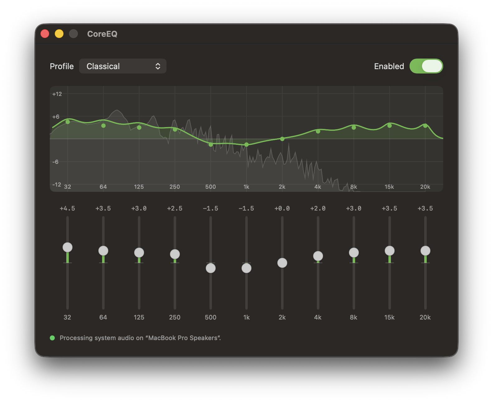

#+TITLE: CoreEQ
#+SUBTITLE: System-wide equalizer for macOS

CoreEQ is a system-wide equalizer for macOS. It lives in your menu bar and
applies a multi-band EQ to *everything you hear* — music, videos, calls,
games — regardless of which app is playing. No virtual audio driver, no kernel
extension: CoreEQ uses Apple's native Core Audio system-tap technology.

* Features

- *System-wide processing* — equalizes all system audio, not per-app.
- *22 built-in profiles* — the classic preset set you know from Spotify and
  iTunes, switchable instantly without clicks or dropouts:

  Flat, Acoustic, Bass Booster, Bass Reducer, Classical, Dance, Deep,
  Electronic, Hip-Hop, Jazz, Latin, Loudness, Lounge, Piano, Pop, R&B, Rock,
  Small Speakers, Spoken Word, Treble Booster, Treble Reducer, Vocal Booster.
- *Eleven bands covering the full audible range* — the professional octave
  ladder 32, 64, 125, 250, 500 Hz, 1, 2, 4, 8 kHz, extended with 15 and
  20 kHz. Each band is adjustable ±12 dB.
- *Live frequency response curve* — the main window plots the exact combined
  response of all filters, updating in real time as you adjust bands or
  switch profiles. Each band appears as a point on the curve, aligned with
  its slider below.
- *Real-time spectrum analyzer* — a live spectrum of the sound you're hearing
  is drawn behind the response curve, on the same frequency axis, so you can
  see the music move against your EQ shaping.
- *Edit by dragging the curve* — drag a band's point up or down directly on
  the plot; the sliders follow, and the audio updates as you drag.
- *Double-click to reset a band* — Lightroom-style: double-click a point on
  the curve or a slider to return that one band to the active profile's
  value.
- *Menu bar first* — change profiles or bypass the EQ in two clicks, without
  opening a window.
- *Instant bypass* — one toggle compares equalized and original sound with no
  glitch.
- *Remembers your settings* — the active profile, your slider tweaks, and the
  on/off state are restored on every launch.
- *Survives real life* — keeps working when you switch output devices, change
  sample rates, or your Mac wakes from sleep.

* Requirements

- macOS *14.2 or later*.
- Permission to record system audio (granted on first launch — see below).

* Installing

CoreEQ is open source and distributed without Apple notarization. There are
two ways to get it.

** Build from source (recommended)

Requires Xcode 16 or later. Apps you build locally are not quarantined by
macOS, so CoreEQ launches with no Gatekeeper warnings at all:

#+begin_src sh
git clone https://github.com/AndreyPudov/core-eq.git
cd core-eq
make install
#+end_src

This builds a Release copy and installs it to =/Applications=.

** Prebuilt binary

Download the latest =CoreEQ-x.y.zip= from the project's *Releases* page,
unzip it, and drag =CoreEQ.app= into =/Applications=.

Because the binary is not notarized, macOS reports on first launch that it
“could not verify the app is free of malware”. To run it anyway, either:

1. Try to open it once, then go to System Settings → Privacy & Security →
   scroll down → *Open Anyway*, or
2. remove the quarantine flag in Terminal:
   #+begin_src sh
   xattr -dr com.apple.quarantine /Applications/CoreEQ.app
   #+end_src

This is needed once per machine, and again after each update.

* First launch

1. Launch *CoreEQ*. A sliders icon appears in the menu bar (there is no Dock
   icon).
2. macOS asks for permission to *record system audio*. CoreEQ needs it to
   process the sound you hear; nothing is saved or sent anywhere. If you
   dismissed the dialog, grant it manually under System Settings → Privacy &
   Security → Screen & System Audio Recording.
3. Pick a profile from the menu bar icon — the sound changes immediately.

* Using CoreEQ

** From the menu bar

Click the sliders icon:

- Choose a *profile* — the active one is checked.
- *Enable Equalizer* — toggle the EQ on and off (bypass).
- *Open CoreEQ…* — open the main window.
- *Quit CoreEQ* — audio returns to normal, unprocessed playback.

** From the main window

- Pick a profile from the dropdown.
- The plot shows the combined frequency response of all bands, with a live
  spectrum of the current audio behind it on the same frequency axis. Drag a
  point on the curve up or down to adjust that band — the slider below
  follows, and the gain value is shown while you drag.
- Drag the vertical sliders to adjust individual bands; the profile name keeps
  its selection and a *Reset* button appears to return to the profile's
  original values. Your tweaks are kept across restarts until you select
  another profile.
- Double-click a point on the curve, or a slider, to reset just that band to
  the active profile's value.
- The switch in the top-right corner enables or bypasses the EQ.
- The status line at the bottom shows which output device is being processed,
  or an error if something is wrong.

* Troubleshooting

- *The sound doesn't change* — check the status line in the main window. If it
  reports a permission problem, grant System Audio Recording access (see
  “First launch”) ; CoreEQ retries automatically.
- *No audio at all* — quit CoreEQ; system audio always returns to the normal,
  unprocessed path when the app is not running (or has crashed).
- *New output device* — CoreEQ follows the system default output device
  automatically; a switch takes effect within about a second.

* Limitations

- Stereo processing: on multi-channel devices, channels beyond the first two
  pass through unequalized.
- Profiles are built-in; custom named profiles cannot be created yet (tweaks
  to the active profile are preserved, though).

* For developers

Build, test, and packaging instructions, plus a tour of the architecture, are
in [[file:DEVELOPMENT.org][DEVELOPMENT.org]].
