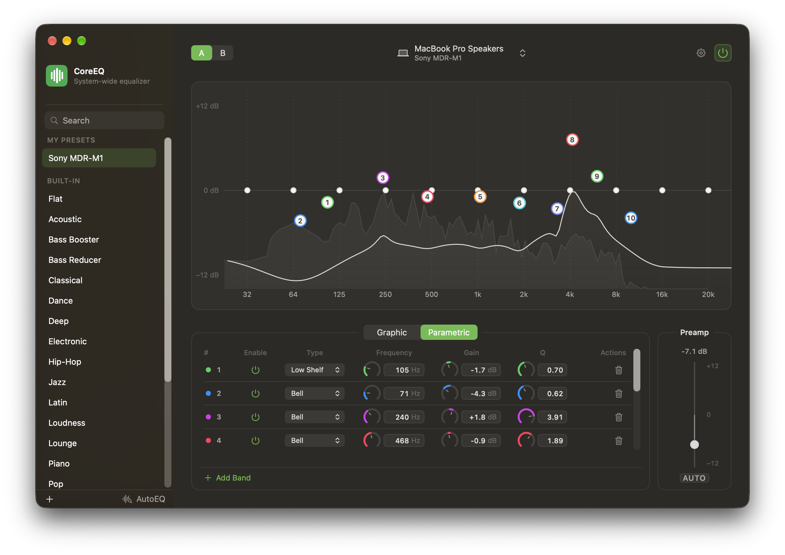

#+TITLE: CoreEQ
#+SUBTITLE: System-wide equalizer for macOS

CoreEQ equalizes *everything you hear* — music, video, calls, games — whatever
application is playing, with no virtual audio driver and no kernel extension.
It runs on Apple's native Core Audio process-tap API, so there is nothing
installed into the system and nothing left behind when CoreEQ is not running.

* Features

** System-wide processing, driver free

A global process tap captures the mixed output of every application, equalizes
it, and plays it back through the current output device. No =/Library/Audio=
component, no reboot, no per-application setup. Quit CoreEQ and system audio
returns to its normal path immediately.

You can check this yourself. Audio drivers live in one folder:

#+begin_src sh
ls /Library/Audio/Plug-Ins/HAL
#+end_src

List it before and after installing CoreEQ: nothing is added. Anything there
was installed by other software, such as BlackHole. The device CoreEQ builds
while it runs is private to the app, so it does not appear in Audio MIDI Setup
either.

** One filter chain, two ways to edit it

The *Graphic* editor is the professional ISO octave ladder — 32, 64, 125, 250,
500 Hz and 1, 2, 4, 8, 16, 20 kHz — at fixed centre frequencies, each adjustable
±12 dB. The *Parametric* editor adds up to sixteen bands of your own anywhere
between 20 Hz and 20 kHz, each a bell, shelf, or pass filter with its own
frequency, gain, and Q.

The two editors are tabs on the editing area's own border, and both edit the
same chain and the same graph: the sliders are eleven filters that happen to be
locked to the ladder, and an added band is one that is not. Nothing is
converted, approximated, or reconciled between the two views, so a change made
in either is exact and reversible.

** Live frequency response, directly editable

The window plots the true combined magnitude response of the chain, computed
from the same coefficients the audio path renders with — not an interpolated
approximation. Drag a handle to change a band, double-click one to reset it,
or double-click empty space to add a parametric band exactly where you clicked.

** Real-time spectrum analyzer

A Hann-windowed FFT of the audio actually reaching your speakers is drawn
behind the response curve on the same frequency axis, with fast-attack /
slow-release smoothing, so you can read the programme material against your
shaping.

** Presets

Twenty-two built-in profiles — the classic set familiar from Apple Music and
Spotify — plus your own, managed from the sidebar. Built-ins are immutable;
your presets can be renamed, duplicated, edited, and deleted. Switching is
instantaneous and glitch-free. Hover a built-in preset, in the sidebar or the
menu, for a one-line description of what it is for.

** Import and export

Presets move in and out as EqualizerAPO text — the format AutoEQ writes its
headphone corrections in — or as CoreEQ's own =.coreeq= files. Import from the
=+= at the bottom of the sidebar, paste with =⌘V=, or drop a file onto the
preset list; every import shows what it found before anything is added. The
*AutoEQ* button beside the =+= walks through getting a correction from
autoeq.app.

From EqualizerAPO text, CoreEQ reads =Preamp:= and =PK=, =LSC=, =HSC=, =HP= and
=LP= filters, with Q or bandwidth in octaves. It reads UTF-8, UTF-16 and
Windows-1252 files. A preset holds up to sixteen filters, gain and preamp within
±12 dB, frequency 20 Hz–20 kHz and Q 0.1–10. A longer file keeps its pass
filters and its strongest bands, and values out of range are brought into it;
the preview says when either happened. =GraphicEQ:=, =Channel:= and other
EqualizerAPO commands are skipped and listed in the preview — so filters meant
for one channel apply to both. A file without a =Preamp:= line gets the
automatic trim.

Export is on a preset's right-click menu, as EqualizerAPO text or =.coreeq=.
Exporting the preset you are listening to writes what you hear, unsaved edits
included.

** Automatic gain

The preamp computes itself, and does so by default. Boosting makes a preset
louder, and louder always sounds better — which would make every comparison a
loudness test rather than a tone test. With *Auto* on, the trim follows the
chain and holds the preset at the loudness it started from, so what you hear
when you compare two presets is the shaping.

It is measured as the average lift across the audible range, weighted equally
per octave. A preset that lifts one narrow band is corrected gently; one that
lifts everything is corrected hard. Nineteen of the twenty-two built-ins lift
the chain on average, so most arrive with a small trim already applied.

The correction only ever attenuates. Cancelling a *cut* would mean raising
every frequency the preset deliberately left alone, which is a way to make
something clip that would not have clipped otherwise — so a preset that mostly
cuts is left quieter, as it was meant to be. Switch *Auto* off, below the
preamp slider, to set the trim by hand.

** A/B comparison

Two working states of one preset, switched from the header. Each holds a
complete sound — the preset, the chain, the trim, and the tone — so A/B compares
two versions rather than undoing one, and the pair belongs to the output device
like everything else you have not saved. Reaching for the other slot the first
time changes nothing: it starts as a copy of what you were hearing, and the first
difference is one you made.

** Per-device settings

The preset in use, any unsaved edits to it, and the preamp follow the *output
device*, the way volume does on macOS. Your headphone curve comes back when you
plug in headphones and gives way to the speaker curve when you unplug them. The
preset library itself is shared across devices.

** Menu bar control

CoreEQ runs as a menu bar application with no Dock icon. The status menu carries
the master switch, output device, the preset list, a live response preview, and
three Quick EQ tone controls (bass, mid, treble) layered over the active preset
— all without opening a window.

** Built to stay running

The engine rebuilds itself when the default output device changes, when the
sample rate changes, and after the machine wakes from sleep, with bounded
automatic retry on failure. Bypass is a real-time flag rather than a teardown,
so comparing processed and original sound is instantaneous. The render path
never allocates or blocks: parameter updates are staged behind an unfair lock
and picked up only when uncontended, and gain changes are smoothed over ~50 ms
so preset switches and slider moves never click or step.

* Requirements

- macOS *14.2* or later
- Permission to record system audio, requested on first launch

* Installation

** Homebrew (recommended)

#+begin_src sh
brew tap andreypudov/core-eq
brew trust andreypudov/core-eq
brew install --cask core-eq
#+end_src

Upgrade later with =brew update && brew upgrade --cask core-eq=.

CoreEQ is currently unsigned and unnotarized, so macOS may block first launch.
Allow it in System Settings → Privacy & Security, or clear the quarantine flag:

#+begin_src sh
xattr -dr com.apple.quarantine /Applications/CoreEQ.app
#+end_src

** Build from source

Requires Xcode 16 or later. Locally built applications are not quarantined, so
CoreEQ launches with no Gatekeeper warnings:

#+begin_src sh
git clone https://github.com/AndreyPudov/core-eq.git
cd core-eq
make install
#+end_src

This builds a Release copy and installs it to =/Applications=.

** Prebuilt binary

Download the latest =CoreEQ-x.y.zip= from the *Releases* page, unzip, and move
=CoreEQ.app= to =/Applications=, then clear the quarantine flag as above.

* First launch

1. Launch CoreEQ. A sliders icon appears in the menu bar; there is no Dock icon.
2. Grant *System Audio Recording* when macOS asks — CoreEQ needs it to process
   the sound you hear. Nothing is recorded, stored, or transmitted. The
   permission can also be granted under System Settings → Privacy & Security →
   Screen & System Audio Recording.
3. Choose a preset. The sound changes immediately.

* Using CoreEQ

*Menu bar* — master switch, output device, preset selection, Quick EQ tone
controls, *Open Equalizer…*, *Settings…*, and *Quit*. CoreEQ has no menu bar of
its own, so this is where those live.

*Settings* — a gear in the window's header, or *Settings…* in the menu. Three
tabs: *General*, which holds *Open CoreEQ at login*, *Release the audio device
when nothing is playing*, *Pause while recording system audio*, and the status
of the System Audio Recording permission; *Diagnostics*, a report of the audio
setup to copy into a bug report; and *About*. Clicking the CoreEQ mark at the
top of the sidebar opens About directly.

*Window* — presets in the sidebar, with a search field and your own presets
above the built-ins, and a bar beneath them: the =+= creates a preset or imports
one, and *AutoEQ* explains how to get a correction for your headphones. Then the
response graph, the *Graphic* / *Parametric* editors, and the preamp on the
right. The output device sits in the centre of the header and names the preset
playing on it underneath, with a dot when that preset has unsaved changes; where
the machine has more than one output, that control is also how you choose
between them. *Revert* sits beside it — next to the preset it would discard —
and the gear and the master switch close the row.

CoreEQ has no volume control. Its one level control is the *preamp*, which is
the same thing a hardware equalizer calls Level: makeup gain for what the curve
took away. Volume belongs to macOS, which offers it in the menu bar, on the
keyboard, and in Sound settings.

The =+= at the bottom of the sidebar creates a *New Preset* from the current
sound, or imports one. Right-click a preset for *Rename*, *Duplicate*, *Save
Changes*, *Reset to Preset*, *Export Preset*, and *Delete*. Right-click a band slider for *Edit as
Filter…*, which moves that band into the parametric editor without changing the
sound.

Editing the active preset marks it *Edited*; *Save Changes* writes the values
into one of your own presets and *Revert* discards them. Your edits, the active
preset, and the on/off state are restored on every launch, per output device.

* Limitations

What CoreEQ does not do, on purpose:

- *No volume control.* macOS already has one, in the menu bar, on the keyboard,
  and in Sound settings. CoreEQ's only level control is the preamp, which
  makes up for what the curve takes away.
- *Not bit-perfect.* CoreEQ works on the system mix, after macOS has mixed and
  resampled every app's audio. At Flat the sound passes through unchanged, and
  switched off CoreEQ leaves the audio path entirely, but it cannot give an app
  exclusive access to the device.
- *One curve for all channels.* On outputs with more than two channels (HDMI,
  DisplayPort, USB interfaces) every channel is equalized, with the same curve.
  There are no per-channel curves and no room correction.

And what it cannot do yet:

- Aggregate and Multi-Output Devices are not supported. Core Audio will not
  nest one aggregate device inside another, so CoreEQ refuses them and names the
  device and the reason rather than failing silently.
- On a device CoreEQ cannot capture stream by stream it falls back to a stereo
  mixdown, and channels beyond the pair the device calls stereo are silent.
  Settings → Diagnostics says when that has happened.
- A screen recording that captures system audio hears each app's original
  sound and CoreEQ's equalized copy 27 ms later, which sounds like an echo. So
  CoreEQ pauses itself while such a recording runs, and says so; *Pause while
  recording system audio* in Settings → General turns this off. The first
  second or so of a recording can still be doubled — switch CoreEQ off before
  recording if the start matters.
- Another tool that re-routes system audio, such as SoundSource, can double the
  sound the same way when both run at once.

* Development

Architecture notes, build and test instructions are in
[[file:docs/DEVELOPMENT.org][docs/DEVELOPMENT.org]]. What has been fixed is in
[[file:docs/RELEASE_NOTES.org][docs/RELEASE_NOTES.org]], and what is still owed is in
[[file:docs/ROADMAP.org][docs/ROADMAP.org]].

#+begin_src sh
make build   # build the Release configuration
make test    # run the unit test suite
make release # build and package a distributable zip
#+end_src

* License

Apache License 2.0. See [[file:LICENSE][LICENSE]].
